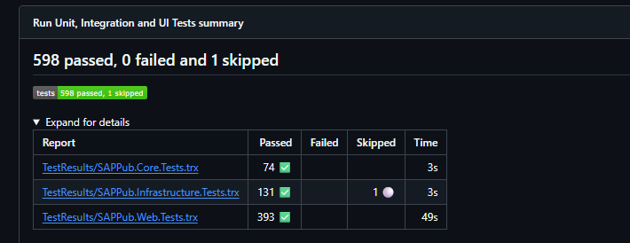
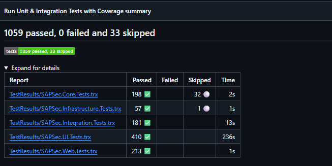
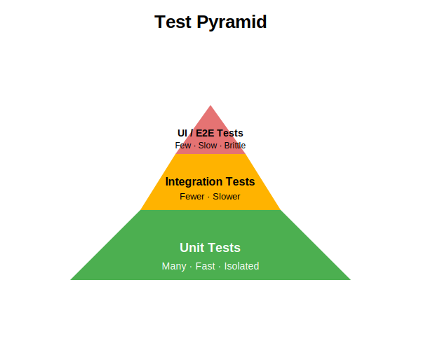

# School profiles design feedback

## Author

- Aasim Ahmed - Senior Test Engineer DfE

## Document Revisions

| Version | Date       | Summary of Change  |
|---------|----------- | -------------------|
| v0.1    | 2026‑04‑13 | Initial draft      |

## Reviewers

- Principal Software Engineer (SD)
- GSII developers (SS, CM)
- Public developers (DM, CL)
- Others (SO)

## Scope

As part of the sap-programmes request for a Test Engineer, a testing‑focused discovery to determine

1) issues with the current application design and test strategy which inhibit testability
2) suggestions for improvement to both

Where design comments exist in both `GSII` and `public` clear examples are provided from both repositories to support the point being made.

## v0.1 Comments

The first output `v0.1` covers high-level application design improvements.

- Core
  - [Build to UseCase contracts](./core/build-to-contract-usecases.md)
  - [Use ValueObjects](./core/use-value-objects.md)
  - [Build a domain model](./core/model-the-problem.md)
  - [Keep data concerns in infrastructure](./core/keep-data-concerns-in-infrastructure.md)
  - [Keep DataTransferObjects immutable](./core/keep-core-dtos-immutable.md)
  - [Share behaviour](./core/share-behaviour.md)
  - [Use Cancellation Tokens](./core/use-cancellation-tokens.md)
- Infrastructure
  - [Share infrastructure](./infrastructure/share-infrastructure.md)
- Presentation
  - [Share presentation components](./presentation/share-presentation.md)
- Data
  - I have avoided the data-ingestion pipeline as this appears duplicated, unclear at present, and, as the application(s) are adopting clean architecture, an assumption is made that a data-store is *hydrated* and read behind an abstraction. It would appear that consideration should be made to share data-ingestion as [SAPData project is a project fork](https://github.com/DFE-Digital/sap-sector/commit/221ca0cbabe6c3051745d4e89cee1afa19a40963) in use across both projects with minor tweaks.

There are design issues across both repositories which should be addressed to avoid long-term maintenance burdens and increase testability. These surface in forms of duplication, lack of abstraction and violations or at-risk areas against SOLID principles.

In the tests symptoms of these issues show as large suites of UI Tests as a proportion to other test types (unit, integration).

This implies the test pyramid is not being applied effectively. UI tests are valuable, but they should not be the primary mechanism for validating business logic. This is what unit testing should fulfil. We have seen other x-data projects find large suites of UI tests difficult to maintain and a lack of granularity that unit and integration tests provide confidence with.

For any design, we should be able to unit test at build giving us a high degree in confidence in behaviour and abstraction implementations. We can use `TestDoubles` in the form of Mocking libraries (`Moq`) and Fakes (`Bogus`) to verify behaviour in these units by substituting dependencies and exercising contracts. This should include;

- Core(Applicatin/Domain)
  - Business rules
  - Models and verifying invariance
  - UseCases
  - ApplicationServices
  - DomainServices
- Infrastructure
  - implementations of Application Repositories/Services
  - Shared Infrastructural implementations (ISqlQueryReader -> DapperQueryReader, ISearchIndexAdapter -> PostgresSearchIndexAdaptor)
- Presentation
  - Controllers (Presentation)
  - Resolving contracts through a built CompositionRoot e.g. `_provider.GetService<TService>().Should().NotBeNull()`.

For some components (UseCases, Infrastructure, Presentation) we should integration test at build using tools like `Docker`, `TestContainers`, `WireMock` and `WebApplicationFactory` to exercise out of process `I/O`. There should be far fewer integration tests than unit tests - adhering to the principles of the testing pyramid
