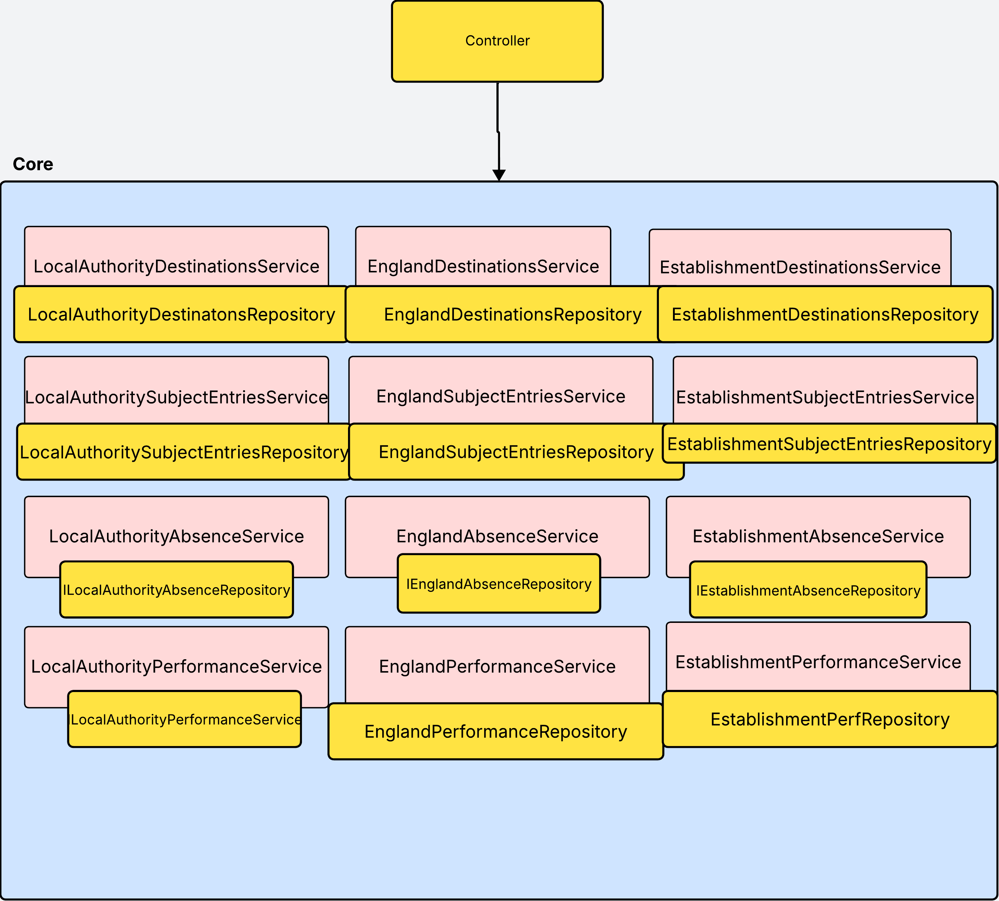
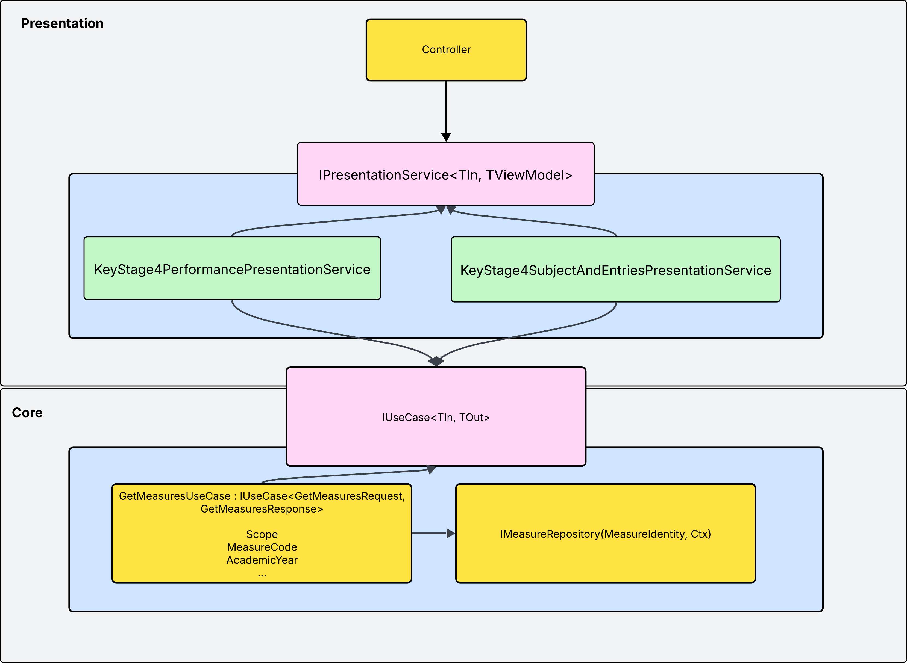

# Build to contract - UseCases

## Point

We should be designing to contracts (e.g. `interfaces`) promoting loose coupling so that we can change or decorate implementations - encouraging SOLI**D** (dependency inversion)

Clean architecture promotes UseCases e.g. `IUseCase` as it make application intent, boundaries, and orchestration explicit.

`Services` on the other hand are vague and encourage `Anemic orchestration` around data.

## Problems

- Software architecture using `Services` does not scream intent or behaviour

- Domain rules are not centralized so are scattered across multiple services.

- Without a behaviour abstraction
  - Consumers of the Services may have to consume large amounts of Services to stitch together data required
  - Consumers are bound to a service contract encoding scope and measure, preventing substitution or decoration at a behavioural level

 so cannot be substituted or decorated. This leads to testing e.g. Mocking or observing on the contract cannot be done, or requiring a Fakes approach.

- Services expose data structures shaped by persistence concerns rather than modelling application behaviour explicitly.

- The system exhibits low extension locality: adding a new measure or scope requires changes across controllers, services, interfaces, dependency registration, and DTOs. We know that more measures will need to be displayed across both services - so the design should be open to extension to aid this need.

## Examples

### GSII

- registering concrete UseCase implementations
  - [`FindSimilarSchoolsUseCase`](https://github.com/DFE-Digital/sap-sector/blob/9bf6df56225c27cb9e35d4f14e52547fdba2dfae/SAPSec.Core/Features/SimilarSchools/UseCases/FindSimilarSchools.cs#L11) consumed [here](https://github.com/DFE-Digital/sap-sector/blob/c874df1b8010e9bd76d5590590871bbdd8ae455e/SAPSec.Web/Controllers/SimilarSchoolsController.cs#L14-L15)
  - [`GetKs4HeadlineMeasuresUseCase`](https://github.com/DFE-Digital/sap-sector/blob/9bf6df56225c27cb9e35d4f14e52547fdba2dfae/SAPSec.Core/Features/Ks4HeadlineMeasures/UseCases/GetKs4HeadlineMeasures.cs#L7-L8) consumed [here](https://github.com/DFE-Digital/sap-sector/blob/9bf6df56225c27cb9e35d4f14e52547fdba2dfae/SAPSec.Web/Controllers/SchoolController.cs#L20)
  - [`GetCharacteristicsComparison`](https://github.com/DFE-Digital/sap-sector/blob/c874df1b8010e9bd76d5590590871bbdd8ae455e/SAPSec.Core/Features/SimilarSchools/UseCases/GetCharacteristicsComparison.cs#L3-L4) consumed [here](https://github.com/DFE-Digital/sap-sector/blob/c874df1b8010e9bd76d5590590871bbdd8ae455e/SAPSec.Web/Controllers/SimilarSchoolsComparisonController.cs#L19-L20)

- Duplication per `measure grouping` retrieval - this will continue for every measure-fetching activity for `Primary`, `Middle` etc.
  - [`GetKs4HeadlineMeasure`](https://github.com/DFE-Digital/sap-sector/blob/c874df1b8010e9bd76d5590590871bbdd8ae455e/SAPSec.Core/Features/Ks4HeadlineMeasures/UseCases/GetKs4HeadlineMeasures.cs#L6)
  - [`GetSchoolKs4HeadlineMeasure`](https://github.com/DFE-Digital/sap-sector/blob/c874df1b8010e9bd76d5590590871bbdd8ae455e/SAPSec.Core/Features/Ks4HeadlineMeasures/UseCases/GetSchoolKs4HeadlineMeasures.cs#L8)
  - [`GetAttendanceMeasures`](https://github.com/DFE-Digital/sap-sector/blob/c874df1b8010e9bd76d5590590871bbdd8ae455e/SAPSec.Core/Features/Attendance/UseCases/GetAttendanceMeasures.cs#L6)

- mixing Services, Repository consumption in Web
  - [`ISchoolDetailsService`](https://github.com/DFE-Digital/sap-sector/blob/c874df1b8010e9bd76d5590590871bbdd8ae455e/SAPSec.Core/Interfaces/Services/ISchoolDetailsService.cs#L8)
  - [`IUserService`](https://github.com/DFE-Digital/sap-sector/blob/c874df1b8010e9bd76d5590590871bbdd8ae455e/SAPSec.Web/Controllers/OrganisationController.cs#L13-L14)
  - [`ISimilarSchoolsSecondaryRepository`](https://github.com/DFE-Digital/sap-sector/blob/c874df1b8010e9bd76d5590590871bbdd8ae455e/SAPSec.Web/Controllers/SimilarSchoolsComparisonController.cs#L21)

### Public

- `public` is not creating UseCases and terming these entrypoints `Services` which sometimes wrap other `Services` like [`DestinationsService`](https://github.com/DFE-Digital/sap-public/blob/main/SAPPub.Core/Services/KS4/DestinationsService.cs)

These services are data-centric.

- per measure
- per scope (LA, England)

  

  - [`EstablishmentDetailsService`](https://github.com/DFE-Digital/sap-public/blob/dbc5bf806f612baa5dc5b797ac8c6be3a4afc291/SAPPub.Core/Interfaces/Services/KS4/Destinations/IEstablishmentDestinationsService.cs#L5)
  - [`ILaDestinationsService`](https://github.com/DFE-Digital/sap-public/blob/dbc5bf806f612baa5dc5b797ac8c6be3a4afc291/SAPPub.Core/Interfaces/Services/KS4/Destinations/ILADestinationsService.cs#L5)
  - [`IEnglandDestinationsService`](https://github.com/DFE-Digital/sap-public/blob/dbc5bf806f612baa5dc5b797ac8c6be3a4afc291/SAPPub.Core/Interfaces/Services/KS4/Destinations/IEstablishmentDestinationsService.cs#L5) consumed [here](https://github.com/DFE-Digital/sap-public/blob/0f23db332b135b4f5e51fbbae707453c322fcc04/SAPPub.Web/Controllers/SecondarySchoolController.cs#L17) and [here](https://github.com/DFE-Digital/sap-public/blob/dbc5bf806f612baa5dc5b797ac8c6be3a4afc291/SAPPub.Core/Services/KS4/DestinationsService.cs#L9-L10).
  
  This shows that `Services` in this form become **data-centric** abstractions that **leak persistance concerns** like fields in the database.

  Without an abstraction for `Scope` (LocalAuthority, Establishment, National) or `Measure` (Attainment8, Progress8, English, Physics, SubjectEntries) this leads to mass duplication as observed above.

## Suggestions

How this might look where `IPresentationService` request which measures they require. Importantly these are presentation groupings of measures for a given page. The domain concept remains `Measures`



1) See [Features](/examples/src/DfE.SchoolProfiles.Sector.Core/Features) in `examples` which shows how this could be done.

    - `IUseCase<TIn, TOut>` contract
    - `ImplUseCase` implementation
    - `TIn` request
    - `TOut` response

    registered as

    ```cs
    services.AddScoped<IUseCase<TIn, TOut>, ImplUseCase>();

    // and resolved by consumers as

    public Controller(IUseCase<TIn, TOut> useCase)
    {
      Guard.ThrowIfNull(useCase);
      _useCase = useCase;
    }
    ```

    As a result
    - behaviour is discoverable
        For `GSII` there appear to be at least 4 `IUseCase` behaviors. (s) denoting could be shared across teams.

        - `SearchSchoolByNameOrUniqueReferenceNumberUseCase` (s)
          - Fulfils the initial Search with Filters
        - `GetMeasuresUseCase` (s)
          - The retrieval of `N` measures (Attendance, Progress8). This fulfils `KS4HeadlineMeasures`, `KS4CoreSubjects` and `Attendance` pages.
        - `GetSchoolDetailsUseCase` (s)
          - Retrieving school information fulfilling the `SchoolDetails` page
        - `GetSimilarSchoolsUseCase`
          - Fulfils retrieval of SimilarSchools with Filters, Sorting

    - There are clear boundaries for UseCase In->Out `Tin`, `TOut` and compile-time contract binding
    - UseCase implementations can be tested independently

      ```cs
      [Fact]
      public void Test()
      {
        IRepository repository = Mock<IRepository>
        UseCaseImplementation useCase = new(repository.Object);
        // Act 

        // Assert
      }
      ```

    - Consumers can test against an abstraction

      ```cs
      [Fact]
      public void Test()
      {
        Mock<IUseCase<TIn, TOut>> mockUseCase = UseCaseTestDoubles.Mock<TIn, TOut>

        Controller controller = new(mockUseCase.Object); // This would require an implementation otherwise so asserting on execution flow on the contract would not be possible.

      }
        ```

    - We can change / decorate the implementations in composition quickly without effecting consumers

      ```cs

      services.AddScoped<IUseCase<TIn, TOut>, TImpl1>()

      // To change impl
      services.AddScoped<IUseCase<TIn, TOut, TImpl2>>();

      // decorating with extra behaviour e.g. logging, which could wrap multiple usecases if open generic
      services.AddScoped<TImpl1>();

      services.AddScoped<IUseCase<TIn, TOut>>(sp => 
        new DecoratedUseCase<TIn, TOut>(
          sp.GetRequiredService<TImpl1>()));

      ```

2) use `internal` to enforce dependency contracts than implementations (soli**D**)

    ```cs
    internal sealed GetSchoolDetailsUseCase : IUseCase<>
    ```

3) Consider exposing a composition root to register a feature (Vertical slices)

    ```cs
    AddSearchByName();

    public static IServiceCollection AddSearchSchoolByName(this IServiceCollection services)
    {
      services.AddSharedInfrastructure();
      services.TryAddScoped<IUseCase<TIn, TOut>, Impl>();
      services.TryAddScoped<ISearchService, Impl>
    }
    ```

4) Consider projects to enforce dependency separation through compiler than folders (Domain, Core, Infrastructure)

    ```text
    Core/
      Application/
        UseCases/
          ...
        DfE.SchoolProfiles.GSII.Application.csproj
      Domain/
        ValueObjects/
          ...
        DfE.SchoolProfiles.GSII.Domain.csproj
    Infrastructure
      DfE.SchoolProfiles.GSII.Infrastructure.csproj
    ```
